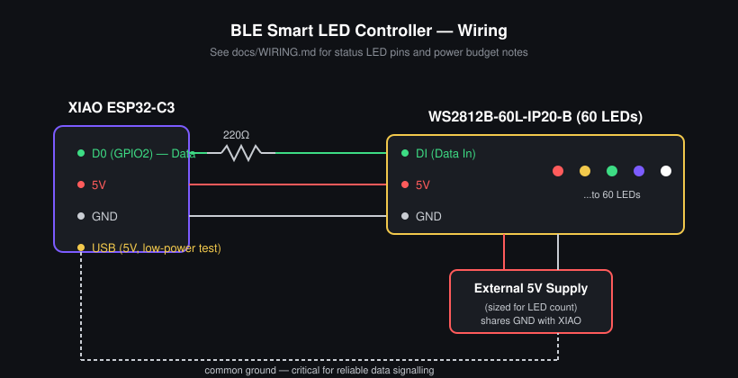

# Wiring

## Seeed Studio XIAO ESP32-C3 ↔ WS2812B-60L-IP20-B

| Strip wire | Connects to | Notes |
|---|---|---|
| 5V (power) | External 5V supply (not the XIAO's 3.3V/USB 5V rail for the full strip) | 60 LEDs at full white/full brightness can draw ~3.6A. USB power is fine for testing at low brightness / partial strip, but use a proper 5V supply for the full 40+ LED run. |
| GND | XIAO GND **and** external 5V supply GND (common ground) | Critical — without a shared ground, data signalling will be unreliable or the strip won't respond at all. |
| DI (data in) | XIAO `D0` (`GPIO2` on the C3) | This matches `LED_STRIP_PIN` in `firmware/include/config.h`. |

**Recommended additions (you already have the parts):**
- A **220Ω resistor** in series on the data line, close to the strip's DI pin — protects the first LED from data-line ringing/spikes.
- A **large capacitor (470–1000µF, 6.3V+)** across 5V/GND at the strip's input — smooths inrush current when many LEDs switch on at once. (Not in your current parts list — optional but recommended if you see flicker/reset issues at higher brightness.)

## Status indicator LEDs (Phase 4)

Reserved pins (see `config.h`) for discrete LEDs through 220Ω resistors,
used to show BLE connection state without needing the phone:

| Pin | Meaning |
|---|---|
| `D1` | Advertising (not yet connected) |
| `D2` | Connected |
| `D3` | Error state |

Each: `GPIO → 220Ω resistor → LED anode → LED cathode → GND`.

## Power budget note

FastLED's `setBrightness()` scales all pixel output, which is the main
software-side safeguard against overcurrent — but it's not a substitute
for adequate power supply sizing. At `DEFAULT_BRIGHTNESS` (128/255, ~50%)
with mixed colors (not all-white), USB power is generally fine for
initial bring-up and demos.
